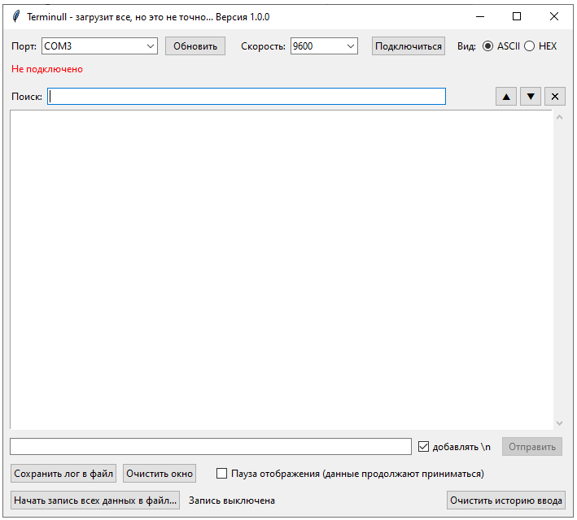

## Terminull
Графический терминал для работы с устройствами через COM-порт или USB-порт.

Особенности: 
- Отображение принятых данных в ASCII и HEX форматах
- Поиск и подсветка данных в окне терминала с возможностью навигации по ним вверх и вниз
- Авто-заполнение ранеее отправленных данных (команд)
- Сохранение данных в файл

Скачать версию для Windows в папке dist.
Команду на сборку можно взять из файла build_cmd.bat

